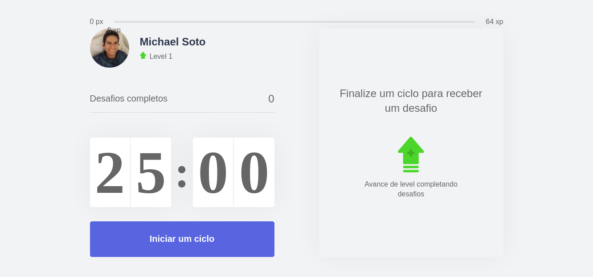

<h1 align="center">
  
</h1>

<p align="center">
  <a href="#-tecnologias">Tecnologias</a>&nbsp;&nbsp;&nbsp;|&nbsp;&nbsp;&nbsp;
  <a href="#-projeto">Projeto</a>&nbsp;&nbsp;&nbsp;|&nbsp;&nbsp;&nbsp;
  <a href="#-layout">Layout</a>&nbsp;&nbsp;&nbsp;|&nbsp;&nbsp;&nbsp;
  <a href="#-como-executar">Como executar</a>&nbsp;&nbsp;&nbsp;
  
</p>

<p align="center">
  

 
</p>

<br>

<p align="center">
  
</p>

## ✨ Tecnologias

Esse projeto foi desenvolvido com as seguintes tecnologias:

- [React](https://reactjs.org)
- [Next.js](https://nextjs.org/)
- [TypeScript](https://www.typescriptlang.org/)

## 💻 Projeto

O move.it é um app que une a técnica de Pomodoro com a realização de exercícios físicos para quem passa muito tempo na frente do computador.

## 🔖 Layout

Você pode visualizar o layout do projeto através [desse link](https://www.figma.com/file/ge20pu3ofMOKoliUyKx1Nl/Move.it-1.0). É necessário ter conta no [Figma](http://figma.com/) para acessá-lo.

## 🚀 Como executar

# Clonar o repositorio
```bash
$ git clone https://github.com/nicksoto1/moveit-nlw-main.git
```
# Acessar o repertório 
```bash
$ cd moveit-nlw-main
```

# Instalar as dependências
```bash
$ npm install
```

# Iniciar o projeto
```bash
$ npm dev
```


Agora você pode acessar [`localhost:3000`](http://localhost:3000) do seu navegador.


Feito com ♥ by Rocketseat 👋🏻 [Participe da nossa comunidade!](https://discordapp.com/invite/gCRAFhc)

## ✒️ Author

<a href="https://github.com/nicksoto1">
 
 <br />
 <sub><b>Michael Soto</b></sub></a> <a href="https://github.com/nicksoto1">🚀</a>
 <br />
